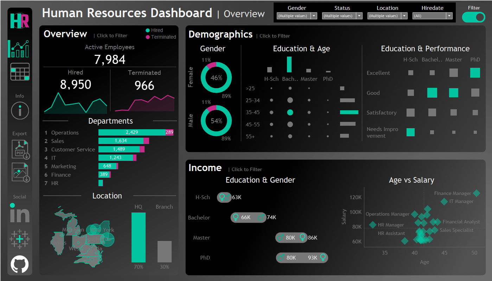

# 👥 HR Dashboard Project | Tableau

🔗 **View the Interactive Dashboard on Tableau Public**:  
[Human Resources Analytics Dashboard](https://public.tableau.com/app/profile/ishan.prabhune/viz/HRAnalyticsDashboard_17494412782110/HRSummary)

---

## 📁 Project Data

The dataset used in this HR Dashboard project was generated using a combination of **ChatGPT prompts** and the **Python Faker library**. It simulates real-world HR information such as:

- Employee demographics  
- Job and department details  
- Salaries and performance evaluations  
- Attrition and employment status  

This rich synthetic dataset offers meaningful structure and complexity for effective analysis and visualization in Tableau.

---

## 🎯 User Story – HR Dashboard

**As an HR manager**, I want a comprehensive dashboard to analyze human resources data, providing both **summary views** for high-level insights and **employee records** for in-depth analysis.

---

## 📊 Dashboard Structure

### 🔹 1. Summary View

This view is divided into **three main sections**: Overview, Demographics, and Income Analysis.

#### 📌 Overview
- Display total number of **hired**, **active**, and **terminated** employees.
- Visualize the number of **hired vs. terminated employees** over the years.
- Show a breakdown of employees by **department** and **job title**.
- Compare employee distribution between **Headquarters (HQ: New York)** and **branches**.
- Display the **geographic distribution** of employees by city and state.

#### 🧬 Demographics
- Visualize the **gender ratio** in the company.
- Show the distribution of employees across **age groups** and **education levels**.
- Present the **total count of employees** by age and education groups.
- Analyze the **correlation** between education level and performance ratings.

#### 💰 Income Analysis
- Compare **salaries by education level and gender** to identify discrepancies.
- Explore how **age correlates with salary** across departments.

---

### 🔹 2. Employee Records View

A detailed table view to access individual employee data:

- Includes fields like **name**, **department**, **position**, **gender**, **age**, **education**, and **salary**.
- Fully **filterable** by all available columns for custom employee lookups.

---

## 🛠 Tools Used

- **Tableau Public** for building and publishing the dashboard  
- **Python + Faker Library** for generating synthetic HR data  
- **ChatGPT** for scenario planning and data modeling logic  

---

## 🖼️ Dashboard Screenshots

### 📍 Summary View

  
*Overview of employee headcounts and organizational distribution*

  
*Demographics and income analysis across various attributes*

### 📍 Employee Records View

  
*Full list of employees with key filters and metrics*

  
*Detailed insights into employee data, education, and salaries*

---

